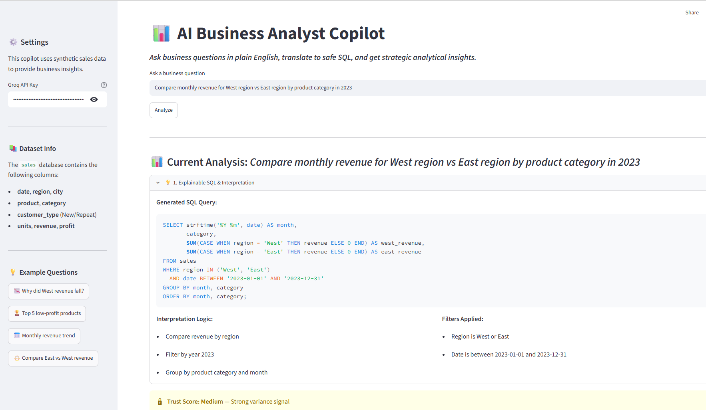
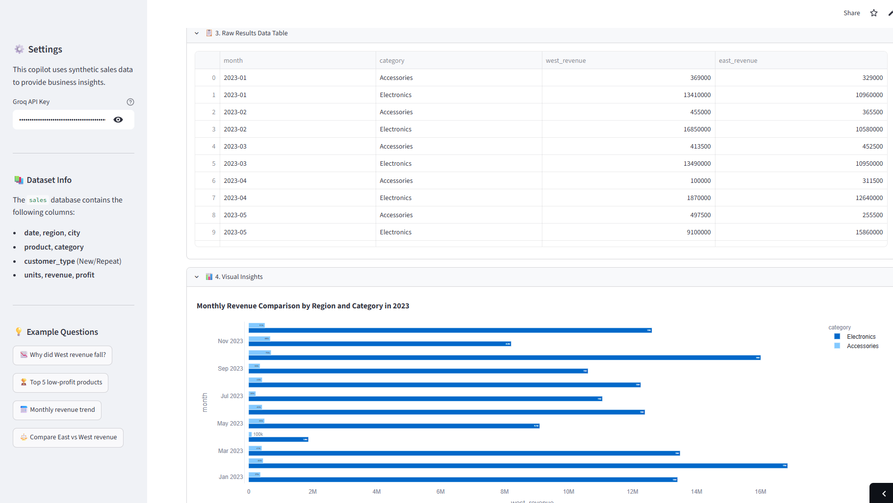
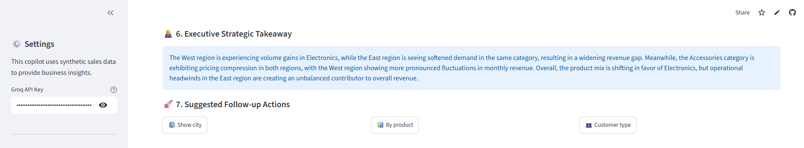
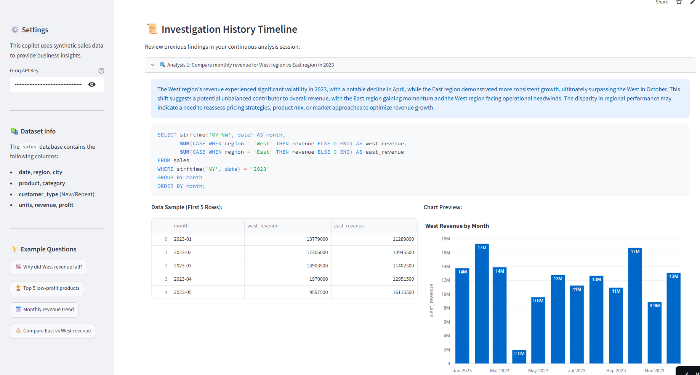

# 📊 AI Business Analyst Copilot

An AI-powered analytical workspace that converts natural language questions into SQL, explains its reasoning, performs root cause analysis, and generates executive-level business insights.

Built with Python, Streamlit, SQLite, Plotly, and Groq-hosted LLMs.

---

## 📱 Application Preview

### Explainable SQL + Trust Score


### Visual Analytics Dashboard


### Executive Insights + Follow-Up Actions


### Investigation Timeline


---

## 💡 Why This Project?

Most NL-to-SQL projects stop at query generation. This project explores what happens after SQL generation:

* **Can AI explain its reasoning?** Demystifying machine-generated code for business stakeholders.
* **Can it identify likely business drivers?** Going beyond descriptive tables to diagnostic Period-over-Period contribution analysis.
* **Can it communicate findings in stakeholder language?** Translating raw numbers into concise, executive-level summaries.
* **Can it guide users toward deeper investigations?** Maintaining a contextual workflow with proactive exploration recommendations.

The result is a comprehensive **AI Business Analyst Copilot** rather than a simple SQL generator.

---

## ✨ Key Features

### 🔍 Explainable SQL & Safety Layer
* **NL → SQL Compilation**: Translates natural language into precise SQLite queries.
* **Trust Score Engine**: Programmatically audits data calendar coverage, row count, and variance to gauge statistical reliability.
* **Explainability Panel**: Breaks down prompt-to-schema field mappings, active SQL filters, and generation confidence.
* **SQL Guardrails**: Regex-based analytical execution sandbox blocking any destructive statements (`DROP`, `DELETE`, `UPDATE`, `ALTER`, `INSERT`, `TRUNCATE`).

### 🎯 Root Cause Analysis (Period-over-Period)
* **Business Driver Layer**: Runs mathematical contribution calculations across dimensions (`category`, `product`, `city`, and `customer_type`).
* **Dynamic Attribution**: Automatically identifies and ranks the top 3 statistical drivers for any positive sales gains or negative dips.

### 📈 Executive Narrative Generation & McKinsey Annotations
* **Executive Translation**: Generates concise, 2-to-3 sentence executive-level summaries of query results tailored for business stakeholders (focusing on pricing compression, volume gains, product mix shifting).
* **Intelligent Annotations**: Places dynamic red annotation arrows directly on Plotly visualization coordinates to highlight strategic findings.

### 🧠 Smart Query Clarification
* **Ambiguity Detection**: Flags vague, database-unfriendly requests containing subjective adjectives like *"bad products"* or *"worst region"*.
* **Interactive Resolution**: Pauses compilation to offer database-friendly metric options (Low Revenue, Low Profit, Declining Sales, Low Units) to fully rewrite and resolve the query.

### 📜 Stateful Investigation Timeline
* **Timeline Explorer**: Caches the last 5 analytical iterations in `st.session_state` and renders them in stateful, collapsible chronological timeline cards.
* **Contextual Next Steps**: Inherits previous query metrics, region filters, and dates to build coherent follow-up questions automatically using LLM rewriting.

---

## 🔄 Analytical Workflow

Recruiters and system architects love to see how data flows. Below is the end-to-end cognitive workflow of the Copilot:

```
User Question
      ↓
Ambiguity Detection (Checks for subjective adjectives)
      ↓
Query Clarification (If ambiguous, asks for user selection)
      ↓
NL → SQL Generation (Synthesizes SQL from database schema)
      ↓
SQL Validation (Safety layer blocks destructive statements)
      ↓
Database Execution (Read-only execution against SQLite)
      ↓
Visualization (Dynamic chart type matching & annotations)
      ↓
Root Cause Analysis (Pandas PoP contribution calculations)
      ↓
Executive Narrative (Synthesizes stakeholder takeaways)
      ↓
Follow-Up Recommendations (Context-aware next steps)
```

---

## 🛠️ Technology Stack

* **UI Framework:** Streamlit (Stateful Session State Management)
* **Cognitive Engines:** Groq API (`llama-3.3-70b-versatile` & Llama-based SQL models)
* **Data Reshaping & Statistics:** Pandas, NumPy
* **Visualizations:** Plotly Express
* **Database:** SQLite (`sales.db`)

---

## ⚙️ Installation & Setup

1. **Clone the Repository**:
   ```bash
   git clone <repository-url>
   cd "AI-Business-Analyst-Copilot"
   ```

2. **Set Up a Virtual Environment & Dependencies**:
   ```bash
   python -m venv .venv
   
   # Activate virtual environment
   # On Windows:
   .venv\Scripts\activate
   # On macOS/Linux:
   source .venv/bin/activate
   
   pip install -r requirements.txt
   ```

3. **Configure Environment Variables**:
   - Create a `.env` file in the root directory.
   - Add your Groq API Key:
     ```env
     GROQ_API_KEY=your_groq_api_key_here
     ```
     *(Alternatively, you can input this directly in the Streamlit Sidebar).*

---

## 🚀 Execution & Usage

### 1. Populate Synthetic Sales Data
Before running the application for the first time, populate the SQLite database with 5,000 synthetic sales records containing built-in seasonality and trend test cases (such as an April drop in the West region):
```bash
python data/generate_data.py
```

### 2. Run the Streamlit Workspace
Execute the main Streamlit application:
```bash
streamlit run app.py
```

---

## ⚡ Try These Sample Diagnostic Queries!

Open the dashboard and test the following scenarios to observe the copilot's deep analytical workspace capabilities:

1. **Smart Clarifier**:
   - *Type*: `"show bad products"`
   - *Result*: The UI pauses, warns about the ambiguous term `"bad"`, and prompts you with options. Click `"💸 Low Profit"`. It completely rewrites the query to *"Show top 5 products by total profit in 2023"* and auto-runs, outputting a descending horizontal bar chart with a red McKinsey-style annotation arrow!

2. **McKinsey Annotation Arrow**:
   - *Type*: `"Why did West region revenue fall in April 2023?"`
   - *Result*: Look at the chart. You will see a **styled red callout arrow** pointing directly at the `"Laptop"` or `"Electronics"` coordinate stating *"Laptop contributed -50% to West region drop"*! A dedicated **🔍 Root Cause** comparison tab also spawns showing the $13.9M vs $1.9M delta statistics.

3. **Multidimensional Chart Grouping**:
   - *Type*: `"Compare monthly revenue for West region vs East region in 2023"`
   - *Result*: Plotly renders a grouped multi-series line chart displaying months on the X-axis, color-coded by region with an automatic legend, showcasing East vs West performance side-by-side.

4. **Chronological Timeline Expanders**:
   - Execute 3 or 4 questions in sequence. Scroll down to see the **"📜 Investigation History Timeline"**. Click on previous expanders to review old charts, SQL queries, raw data sample tables, and narratives archived below without cluttering the screen.
